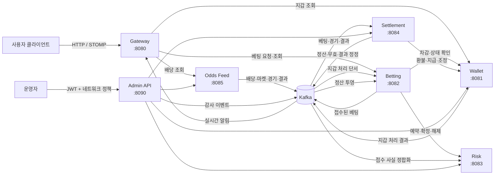

# Sportsbook Backend Archive

Java 17과 Spring Boot를 기반으로 스포츠북 백엔드의 핵심 기능을 독립 서비스로 구현한
아카이브입니다. 배당 수집, 베팅 접수, 위험 심사, 자금 원장, 결과 정산과 정정, 운영자
명령, 공개 API와 실시간 알림을 하나의 분산 시스템으로 구성합니다.

이 프로젝트의 중심 주제는 기능 수가 아니라 **금전 상태의 소유권**, **멱등 처리**,
**불확실한 외부 호출 결과의 복구**, **순서가 보장되지 않는 이벤트 처리**, **고정된
서비스 조합의 재현 가능한 통합 검증**입니다.

## 검증된 릴리스

- Release: `1.0.0`
- Orchestration tip:
  [`dcfc01345377aeccefd2eeb15cb4b9736a669b10`](https://github.com/seungwoo7050/sportsbook-archive/commit/dcfc01345377aeccefd2eeb15cb4b9736a669b10)
- [GitHub Actions 최종 검증](https://github.com/seungwoo7050/sportsbook-archive/actions/runs/32657305364):
  375개 커밋의 history guard, 239개 정적 계약 테스트, cold release gate와 13개 E2E
  시나리오 통과
- 검증된 서비스 조합:
  [`orchestration/services.lock`](https://github.com/seungwoo7050/sportsbook-archive/blob/orchestration/services.lock)

정확한 artifact, topic, migration, readiness와 cleanup 결과는
[`handoffs/wave4/integration.md`](handoffs/wave4/integration.md)에 기록되어 있습니다.

> [!IMPORTANT]
> 이 저장소는 모노레포가 아닙니다. `main`에는 저장소 안내와 구현 단계별 handoff 문서만
> 있으며, 실제 서비스 코드는 각각의 독립된 orphan 브랜치에 있습니다.
>
> 서비스 브랜치는 `main`에 병합하기 위한 기능 브랜치가 아닙니다. 각 브랜치를 별도
> 저장소처럼 읽고 빌드해야 하며, 전체 시스템에서 함께 검증된 정확한 조합은
> `orchestration` 브랜치의 `services.lock`이 결정합니다.

## 저장소 구성 방식

이 저장소는 세 종류의 브랜치로 나뉩니다.

| 구분 | 역할 |
| --- | --- |
| `main` | 전체 프로젝트 색인과 Wave 0~4 handoff 문서를 보관합니다. 실행 코드는 없습니다. |
| 서비스 브랜치 | 각 서비스의 코드, 테스트, 필요한 마이그레이션, CI와 운영 문서를 독립된 이력으로 보관합니다. |
| `orchestration` | 서비스별 정확한 커밋을 고정하고 전체 스택을 빌드·실행·검증하는 통합 브랜치입니다. |

orphan 브랜치를 사용한 이유는 서비스별 이력을 독립적으로 유지하면서도, 관련 구현과
설계 문서를 하나의 GitHub 저장소에서 찾을 수 있게 하기 위해서입니다. 이 구조에서는
브랜치 전환이 디렉터리 이동이 아니라 **서로 다른 프로젝트로 작업 트리를 교체하는
동작**이라는 점에 주의해야 합니다.

## 시스템 개요



동기 호출은 내부 HTTP API를 사용하고, 서비스 사이의 비동기 사실 전달은 Kafka와 raw
Avro 레코드를 사용합니다. Java 값 객체, 오류 표현, Avro 스키마는
`shared-protocol:1.0.0`이 제공합니다.

## 브랜치 안내

| 브랜치 | 주요 역할 | 상태 저장소와 기반 시설 | 기본 포트 |
| --- | --- | --- | ---: |
| [`shared-protocol`](https://github.com/seungwoo7050/sportsbook-archive/tree/shared-protocol) | 공통 값 객체, 오류 형식, Avro 이벤트 계약 | 실행 상태 없음, Maven 라이브러리 | - |
| [`gateway`](https://github.com/seungwoo7050/sportsbook-archive/tree/gateway) | 공개 HTTP·STOMP 진입점, JWT 검증, 요청 제한, 허용 경로 프록시, 실시간 이벤트 전달 | Redis, Kafka, 프로세스 로컬 WebSocket 세션 | 8080 |
| [`wallet-service`](https://github.com/seungwoo7050/sportsbook-archive/tree/wallet-service) | 잔액, 잠긴 자금, 복식 원장, 정산 조정, 지갑 이벤트 | PostgreSQL이 기준, Redis는 보조 단서, Kafka outbox | 8081 |
| [`betting-service`](https://github.com/seungwoo7050/sportsbook-archive/tree/betting-service) | 베팅 접수, 지속적인 접수 복구, 사용자별 조회, 정산 결과 투영 | PostgreSQL이 기준, Odds Redis projection 참조, Kafka outbox | 8082 |
| [`risk-service`](https://github.com/seungwoo7050/sportsbook-archive/tree/risk-service) | 베팅 허용 판정, 한도, 단기 예약, 의심 패턴 평가 | Redis가 런타임 기준, Kafka | 8083 |
| [`settlement-service`](https://github.com/seungwoo7050/sportsbook-archive/tree/settlement-service) | 경기 결과 처리, 베팅 정산, 전체 무효, 결과 정정과 복구 | PostgreSQL이 기준, Kafka | 8084 |
| [`odds-feed-service`](https://github.com/seungwoo7050/sportsbook-archive/tree/odds-feed-service) | 외부 배당 정규화, 경기·마켓 상태 투영, 결과 이벤트 발행 | Redis, Kafka | 8085 |
| [`admin-api`](https://github.com/seungwoo7050/sportsbook-archive/tree/admin-api) | 운영자 인증·권한, 서비스별 관리 명령, 실패 폐쇄형 감사 기록 | PostgreSQL이 감사 기준, Kafka는 보조 발행 | 8090 |
| [`orchestration`](https://github.com/seungwoo7050/sportsbook-archive/tree/orchestration) | 고정 커밋 빌드, Compose 실행, 장애 주입, 전체 E2E 검증, 증거 수집 | Docker Compose, PostgreSQL, Redis, Kafka, 관측 도구 | - |

표의 포트는 서비스를 개별 실행할 때의 기본값입니다. `orchestration`의 전체 스택은
백엔드 네트워크를 비공개로 유지하고 Gateway 호스트 포트를 실행마다 동적으로
할당합니다.

## 상태 소유권

여러 서비스가 같은 데이터를 임의로 수정하지 않습니다. 각 상태에는 한 개의 기준
소유자가 있습니다.

| 상태 | 기준 소유자 | 기준 저장소 |
| --- | --- | --- |
| 사용자 잔액, 잠긴 자금, 원장, 조정 결과 | Wallet Service | PostgreSQL |
| 베팅 접수 상태, 멱등 키, 복구 작업, 정산 투영 | Betting Service | PostgreSQL |
| 허용 한도, 예약 용량, 단기 위험 상태 | Risk Service | Redis |
| 현재 배당, 마켓 상태, 공급자·운영자 제한 상태 | Odds Feed Service | Redis |
| 결과 후보, 기본 정산, 정정 계획, 지갑 처리 증거 | Settlement Service | PostgreSQL |
| 운영자 명령의 시작·완료·불확실 상태 | Admin API | PostgreSQL |
| 요청 제한 버킷 | Gateway | Redis |
| WebSocket 연결과 만료 작업 | Gateway 실행 프로세스 | 프로세스 메모리 |

Kafka 레코드는 서비스 사이에서 사실을 전달하거나 복구 작업을 깨우는 수단입니다.
금액과 정산의 최종 판단을 Kafka 전달 여부나 프로세스 메모리에만 의존하지 않습니다.

## 핵심 처리 경로

### 베팅 접수

1. Gateway가 사용자 JWT와 요청 제한을 검증한 뒤 허용된 내부 경로로 요청을 전달합니다.
2. Betting Service가 요청 멱등성과 베팅 접수 상태를 지속적으로 관리합니다.
3. Risk Service가 사용자 한도와 현재 사용량을 원자적으로 검사하고 단기 예약을 만듭니다.
4. Betting Service는 예약 식별자를 보존한 뒤 Wallet Service의 자금 차감·잠금 작업을
   안정적인 멱등 식별자로 호출합니다.
5. 접수가 확정되면 Betting Service가 베팅 상태와 outbox 레코드를 함께 저장하고
   `bet.placed.v1`을 발행합니다.
6. 네트워크 시간 초과처럼 업무 성공·실패를 판단할 수 없는 결과는 임의로 거절하지
   않고 `PENDING` 상태로 남긴 뒤 저장된 증거를 기준으로 복구합니다.

### 정산과 결과 정정

1. Odds Feed Service가 경기 종료 상태와 공식 결과를 Kafka에 발행합니다.
2. Settlement Service는 베팅, 경기 상태, 결과가 서로 다른 topic에서 역순으로 도착해도
   먼저 도착한 사실을 저장하고 나중에 누락된 입력을 보충합니다.
3. 정산에 필요한 환불, 수익 지급, 자금 몰수, 결과 정정 금액은 Wallet Service만
   수행합니다.
4. 외부 호출 전에 시도와 멱등 식별자를 저장하며, 응답을 잃은 경우에도 같은 작업을
   새로운 업무 결정으로 만들지 않습니다.
5. 결과 정정은 기존 결과와 새 결과, 지급 차이, 지갑 작업 식별자를 포함한 변경 불가
   계획으로 저장됩니다.
6. 완료된 정산은 `bet.settled.v1`, `bet.voided.v1`,
   `bet.resolution.revised.v1`로 전달되어 Betting Service와 Gateway의 조회·알림 상태에
   반영됩니다.

### 운영자 명령과 감사

1. Admin API는 RS256 JWT, 역할, IP 허용 목록과 신뢰 프록시 설정을 검증합니다.
2. 감사 대상 변경 요청마다 UUIDv7 작업 식별자를 생성합니다.
3. 하위 서비스를 호출하기 전에 PostgreSQL에 `STARTED` 감사 행을 별도 트랜잭션으로
   저장합니다.
4. 감사 시작 기록을 남길 수 없으면 하위 서비스를 호출하지 않습니다.
5. 각 하위 서비스에는 서로 다른 전용 자격 증명을 사용합니다.
6. 완료 결과는 PostgreSQL에 확정하고, Kafka의 `admin.action` 발행은 보조 경로로
   처리합니다.

## 공통 계약과 Kafka topic

`shared-protocol` 브랜치는 서비스가 함께 사용하는 Java 값 객체와 wire v1 Avro
스키마를 소유합니다. 서비스별 데이터베이스 모델, 위험 정책, 잔액 계산, 정산 규칙은
공통 라이브러리에 넣지 않습니다.

| 영역 | topic |
| --- | --- |
| 지갑 | `wallet.debited.v1`, `wallet.credited.v1`, `wallet.debit-failed.v1` |
| 위험 | `risk.limit.violated`, `risk.pattern.suspected` |
| 배당과 경기 | `odds.changed`, `market.status.changed`, `event.lifecycle`, `match.result` |
| 베팅 접수 | `bet.placed.v1` |
| 정산 | `bet.settled.v1`, `bet.voided.v1`, `bet.resolution.revised.v1` |
| 운영 감사 | `admin.action` |

통합 환경에서는 topic 자동 생성을 비활성화합니다. topic 수, 파티션 수, 보존 기간은
`orchestration` 브랜치의 manifest로 확인하며, 이미 존재하는 topic의 설정이 다르면
자동 수정하지 않고 구성 불일치로 실패합니다. 소비되는 source topic의 dead-letter
topic은 대문자 `.DLT` 접미사를 사용하고 원본 파티션을 유지합니다.

## 구현 순서와 handoff 문서

`main/handoffs`는 코드 사용 설명서가 아니라 각 구현 단계가 다음 단계에 넘긴 계약,
통합 의무, 완료 상태를 기록합니다. 프로젝트를 설계 순서대로 읽을 때 유용합니다.

| Wave | 구현 범위 | 대표 문서 |
| --- | --- | --- |
| 0 | 공통 Java·Avro 계약 확정 | [`shared-protocol`](handoffs/wave0/shared-protocol.md) |
| 1 | Wallet, Risk, Odds Feed, Gateway의 독립 기반 구현 | [`wallet`](handoffs/wave1/wallet-service.md), [`risk`](handoffs/wave1/risk-service.md), [`odds`](handoffs/wave1/odds-feed-service.md), [`gateway`](handoffs/wave1/gateway.md) |
| 2 | Betting, Settlement와 서비스 간 핵심 거래 경로 통합 | [`betting`](handoffs/wave2/betting-service.md), [`settlement`](handoffs/wave2/settlement-service.md), [`gateway`](handoffs/wave2/gateway.md), [`integration`](handoffs/wave2/integration.md) |
| 3 | 운영자 제어 API와 감사 경로 | [`admin-api`](handoffs/wave3/admin-api.md) |
| 4 | 최종 통합 조건과 재현 가능한 orchestration | [`integration`](handoffs/wave4/integration.md), [`orchestration`](handoffs/wave4/orchestration.md) |

## 브랜치 확인 방법

전체 브랜치를 가져옵니다.

```bash
git clone --no-single-branch \
  https://github.com/seungwoo7050/sportsbook-archive.git
cd sportsbook-archive
git branch --remotes
```

한 작업 디렉터리에서 `git switch`를 반복하면 서비스 전체 파일이 교체됩니다. 여러
서비스를 동시에 읽거나 빌드할 때는 worktree가 안전합니다.

```bash
git worktree add --detach \
  ../sportsbook-shared-protocol origin/shared-protocol

git worktree add --detach \
  ../sportsbook-wallet-service origin/wallet-service

git worktree add --detach \
  ../sportsbook-orchestration origin/orchestration
```

`--detach` 예시는 보관된 코드를 읽고 검증하기 위한 방식입니다. 수정 작업을 할 때는
원격 orphan 브랜치에서 별도의 로컬 작업 브랜치를 만들어야 합니다.

> [!WARNING]
> 서비스 브랜치를 `main`에 병합하거나 `--allow-unrelated-histories`로 하나의 트리로
> 합치지 마십시오. 현재 저장소의 서비스 분리, 이력, 통합 잠금 방식을 훼손합니다.

## 개별 서비스 빌드

7개 Java 애플리케이션 서비스는 `shared-protocol:1.0.0`을 사용합니다. 먼저 공통 artifact를 같은
로컬 Maven 저장소에 설치한 뒤 대상 서비스를 검증합니다.

```bash
export SPORTSBOOK_M2
SPORTSBOOK_M2="$(mktemp -d "${TMPDIR:-/tmp}/sportsbook-m2.XXXXXX")"

(
  cd ../sportsbook-shared-protocol
  ./mvnw \
    -Dmaven.repo.local="${SPORTSBOOK_M2}" \
    clean install
)

(
  cd ../sportsbook-wallet-service
  ./mvnw \
    -Dmaven.repo.local="${SPORTSBOOK_M2}" \
    clean verify
)
```

다른 서비스도 같은 방식으로 검증할 수 있습니다. 실제 실행에 필요한 데이터베이스,
Redis, Kafka, 내부 API 키와 JWT 설정은 각 브랜치의 `README.md`와 운영 문서를 기준으로
구성해야 합니다. 내부 자격 증명에는 운영용 기본값이 없으며, 호출 방향마다 서로 다른
값을 사용합니다.

## 전체 스택 검증

전체 시스템의 지원되는 검증 경로는 `orchestration` 브랜치의
`scripts/cold_release_gate.py`입니다. 이 스크립트는
[`services.lock`](https://github.com/seungwoo7050/sportsbook-archive/blob/orchestration/services.lock)에
기록된 정확한 서비스 커밋을 별도 worktree로 가져오고, 공통 artifact와 7개 실행 JAR를
격리된 환경에서 빌드한 뒤 하나의 Docker Compose 프로젝트를 실행합니다.

필요한 도구는 Git, JDK 17, Docker Compose v2, OpenSSL, Python 3.12입니다.

```bash
cd ../sportsbook-orchestration

python3 -B scripts/history_guard.py
python3 -B -m unittest discover -s tests
python3 -I -B scripts/cold_release_gate.py
```

release gate는 다음 작업을 한 번의 소유권이 분명한 실행으로 처리합니다.

- PostgreSQL, Kafka, Risk·Odds·Wallet·Gateway용으로 분리된 4개 Redis와 7개
  애플리케이션을 시작합니다.
- Toxiproxy로 Betting→Risk, Betting→Wallet, Settlement→Wallet 장애를 주입합니다.
- Prometheus, Loki, Grafana, Promtail을 함께 실행합니다.
- topic, 파티션, Flyway 마이그레이션, consumer 할당을 검증합니다.
- 정상 접수·정산뿐 아니라 시간 초과, 응답 유실, 역순 이벤트, 결과 정정,
  dead-letter 처리, 운영자 감사 상관관계를 검증합니다.
- 로그와 상태를 민감 정보가 제거된 증거 파일로 남깁니다.
- 해당 실행이 만든 컨테이너, 네트워크, 볼륨, worktree와 임시 artifact만 제거합니다.

직접 `docker compose up`을 장기간 실행하는 방식은 지원되는 release 경로가 아닙니다.
고정 artifact, 실행별 자격 증명, 소유권 표식, 증거 수집과 제한된 정리가 release gate에
포함되어 있기 때문입니다.

성공한 검증 증거는 다음 경로에 남습니다.

```text
evidence/cold-gate/<compose-project>/
```

여기에는 서비스 잠금 정보, JAR 해시, 렌더링된 Compose 식별자, topic과 마이그레이션
목록, 최종 readiness, 시나리오 결과, 제한된 로그와 정리 결과가 포함됩니다. 이
디렉터리는 Git에 추적되지 않으며, GitHub Actions에서는 같은 evidence를 14일 보존되는
run artifact로 업로드합니다.

## 검증 범위

개별 서비스의 `./mvnw clean verify`는 브랜치에 따라 다음 항목을 검사합니다.

- Java 형식과 정적 규칙
- 단위 테스트와 HTTP·이벤트 계약 테스트
- PostgreSQL, Redis, Kafka를 사용하는 컨테이너 기반 통합 테스트
- Flyway 마이그레이션의 추가 전용 규칙과 checksum 보호
- 동시 실행, 멱등성, lease 소유권과 오래된 worker 차단
- 실행 JAR 패키징과 브랜치 이력 보호 규칙

최종 release gate는 13개의 E2E 시나리오를 순서대로 실행합니다. 주요 범위는 정상
베팅과 정산, Risk 장애 후 복구, Wallet 응답 유실 후 정확히 한 번의 차감, 경기 종료나
결과가 베팅보다 먼저 도착하는 경우, 지급액 증가·감소 정정, 운영자 승인·거절·재시도,
역순 revision 처리, 동일 파티션 DLT 전달, 감사·trace·하위 서비스 명령의 상관관계입니다.

## 보안과 운영 원칙

- Gateway는 RS256 사용자 JWT를 검증하며 JWT를 발급하지 않습니다.
- Admin API는 RS256 운영자 JWT와 IP 허용 목록을 함께 검사합니다.
- 서비스 간 호출은 호출자·수신자 방향마다 분리된 내부 API 키를 사용합니다.
- release gate는 실행마다 자격 증명과 RSA 키 쌍을 새로 생성합니다.
- 민감한 header와 자격 증명 형태의 값은 구조화 로그와 증거에서 제거합니다.
- 애플리케이션 컨테이너는 비루트 사용자로 실행합니다.
- PostgreSQL schema는 Flyway가 만들고 Hibernate는 검증만 수행합니다.
- Kafka, Redis, 하위 서비스 장애를 곧바로 업무 성공이나 실패로 해석하지 않습니다.

## 관측 가능성

각 서비스는 liveness, readiness와 Prometheus 지표를 제공합니다. 전체 통합 환경에는
Prometheus, Loki, Grafana, Promtail이 포함되며, 최종 검증 시 모든 컨테이너 상태와
애플리케이션 readiness를 다시 수집합니다.

readiness의 의미는 서비스마다 다릅니다. 예를 들어 Wallet과 Settlement의 기준
데이터베이스 장애는 준비 상태에 직접 반영되지만, Admin API의 Kafka 발행은 보조
경로이므로 PostgreSQL과 같은 필수 readiness 의존 항목으로 취급하지 않습니다. 각
서비스의 정확한 health 구성과 지표 이름은 해당 브랜치의 운영 문서를 확인해야 합니다.

## 현재 범위와 제외 항목

이 저장소는 상용 스포츠북 전체 제품이 아니라 백엔드 거래 처리와 통합 검증에 초점을
맞춘 프로젝트입니다. 현재 브랜치 구성에는 다음 요소가 포함되지 않습니다.

- 사용자용 웹·모바일 화면
- 계정 등록, 로그인과 JWT 발급을 담당하는 identity service
- KYC, AML, 책임 도박, 관할별 규제와 라이선스 처리
- 외부 결제 사업자와 실제 입출금 정산
- Kubernetes나 특정 cloud를 대상으로 한 운영 배포 구성
- 다중 Gateway replica를 위한 WebSocket 세션 공유
- Risk Service의 Redis Cluster 배포—현재 release는 standalone Redis만 지원

Odds Feed의 `mock` profile은 결정적인 개발용 경기와 결과를 제공합니다. `real` profile은
제한된 배당 polling을 지원하지만, 상용 공급자의 전체 lifecycle·result 연동을 대체하지
않습니다.

## 문서 기준

문서를 확인할 때는 다음 우선순위를 사용합니다.

1. 개별 서비스의 동작과 실행 방법은 해당 orphan 브랜치의 `README.md`와 `docs/` 또는
   `architecture/` 문서가 기준입니다.
2. 서비스 사이의 검증된 버전 조합은 `orchestration/services.lock`이 기준입니다.
3. 전체 스택의 시작, 검증, 증거와 정리 방식은 `orchestration/README.md`와
   `scripts/cold_release_gate.py`가 기준입니다.
4. `main/handoffs`는 구현 당시의 계약 전달과 통합 의무를 추적할 때 사용합니다.

브랜치의 최신 tip이 `services.lock`에 기록된 커밋보다 앞서 있더라도, 그 tip이 다른
서비스와 함께 최종 검증되었다고 간주해서는 안 됩니다.
